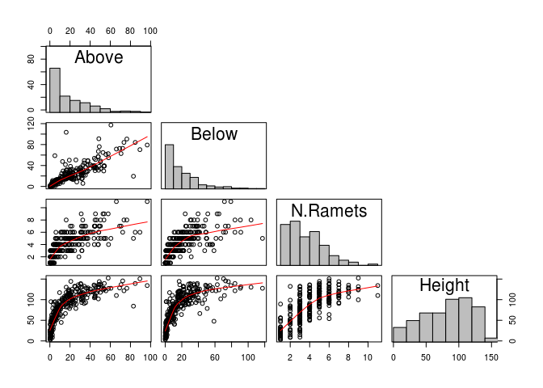
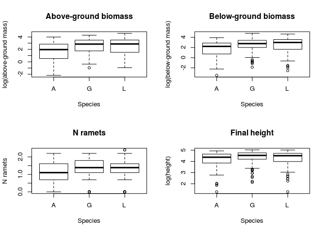

Cattail seedling growth in a common garden experiment (Szabo *et al.* 2017)
===========================================================================

This script relates to data analyses for the common-garden experiment described in Szabo et al. 2017. The experiment involved the growth of seedling cattails (*Typha angustifolia*, *Typha latifolia*, and *T. x glauca*) in 20 small replicate ponds at Trent University, Peterborough, ON. For analyses of other experiments in Szabo et al. 2017, see of other associatedd scripts.

The data is stored as a .csv file and is located in the folder that accompanies this script. This script shows the steps used to evaluate model assumptions and the analyses and figures presented in the paper.

This first block loads all libraries and data used in the analyses.

``` r
rm( list=ls())

require( lme4 ) # version 1.1.12
require( nlme ) # version 3.1-128
require( car )

TEx1 <- read.csv("Exp1.Corrected.csv", header=T) #reads data from *T*ypha *Ex*periment *1* 
TEx1 <- subset(TEx1, Above>0 & Below>0 & Height.F>0) # remove 0 data points 
```

Now some data exploration following Zuur *et al.* (2010) Mixed Effects Models and Extensions in Ecology with R.

Start with dot plots:


In terms of above- and below-ground biomass the dot plot suggests that *T. angustifolia* plants *might* have been smaller than the other species. *T. latifolia* and *T. x glauca* seem fairly similar to each other in terms of their size. There doesn't appear to be much going on for the other variables,and note that below-ground biomass is strongly related to above-ground biomass (see below).

Then a pairplot to examine collinearity and outliers:



Now for some box plots:



The plots further suggests that *T. angustifolia* plants were smaller than plants of the other two species, particularly in terms of biomass.

Now for some basic linear models that include all the effects of interest

``` r
AGB <- TEx1$Above
BGB <- TEx1$Below
NRam <- TEx1$Ramets.T
Ht <- TEx1$Height.F 

#Above-ground biomass
AGB.lm <- lm(log(AGB) ~ Species * Shade * Leachate, data = TEx1)
par(mfrow=c(2,2))
plot(AGB.lm, add.smooth = FALSE, which=1) # no pattern here, assumption of homogeneity seems ok

EA <- resid(AGB.lm) 
hist(EA, xlab="Residuals", main="")
boxplot(EA ~ Species, data=TEx1, main = "Species") # but no heterogeneity of residuals among species levels
boxplot(EA ~ Shade, data=TEx1, main = "Shade") # or shade levels ; boxplot(E ~ Leachate, data=TEx1) # there is a bit of a difference in the spread of residuals for the leachate treatment, but not much
```


``` r
#Below-ground biomass
BGB.lm <- lm(log(BGB) ~ Species * Shade * Leachate, data = TEx1)
plot(BGB.lm, add.smooth = FALSE, which=1) # no pattern here, assumption of homogeneity seems ok
EB <- resid(BGB.lm) 
hist(EB, xlab="Residuals", main="")
boxplot(EB ~ Species, data=TEx1, main = "Species") # but no heterogeneity of residuals among species levels
boxplot(EB ~ Shade, data=TEx1, main = "Shade") # or shade levels ; boxplot(E ~ Leachate, data=TEx1) # there is a bit of a difference in the spread of 
```


``` r
#Nramets
NR.glm <- glm(Ramets.T ~ Species * Shade * Leachate, data = TEx1, family = "poisson")
plot(NR.glm, add.smooth = FALSE, which = 1)
ER <- resid(NR.glm) 
hist(ER, xlab="Residuals", main="")
boxplot(ER ~ Species, data=TEx1, main = "Species") # but no heterogeneity of residuals among species levels
boxplot(ER ~ Shade, data=TEx1, main = "Shade") # or shade levels ; boxplot(E ~ Leachate, data=TEx1) # there is a bit of a difference in the spread of 
```


``` r
#Plant height
Ht.lm <- lm(log(Ht) ~ Species * Shade * Leachate, data = TEx1)
plot(Ht.lm, add.smooth = FALSE, which=1) # some evidence for heterogeneity, will watch this during model selection
EH <- resid(Ht.lm) 
hist(EH, xlab="Residuals", main="")
boxplot(EH ~ Species, data=TEx1, main = "Species") # but no heterogeneity of residuals among species levels
boxplot(EH ~ Shade, data=TEx1, main = "Shade") # or shade levels ; boxplot(E ~ Leachate, data=TEx1) # there is a bit of a difference in the spread of 
```


Some evidence for heterogeneity unless biomass data are log-transformed and for plant height. Check for heterogeneity among ponds. This is done for above-ground biomass. It is needed as a random effect here, and will include it for all analyses.

``` r
par(mfrow=c(1,1), mar=c(4,2,2,1)+0.1) #reset graphical parameters
boxplot(EA ~ Pond, data=TEx1, axes=FALSE, ylim=c(-5.5,3))
abline(0,0); axis(2)
text(1:nlevels(TEx1$Pond), -4.7, levels(TEx1$Pond), cex=0.75, srt=90)
```


The residuals span 0 for all ponds, but are skewed up or down for roughly half of them. Aside from any other considerations, this supports the use of "Pond" as a random effect in any statistical modeling. The next step is to compare models with and without including "Ponds" as a random effect.

``` r
Form <- formula(log(AGB) ~ Species * Shade * Leachate)
M.gls <- gls(Form, data=TEx1)
M.lme <- lme(Form, random =~1|Pond, data=TEx1, method = "REML")
anova(M.gls, M.lme)
```

    ##       Model df       AIC      BIC    logLik   Test  L.Ratio p-value
    ## M.gls     1 13 1019.8808 1066.946 -496.9404                        
    ## M.lme     2 14  954.7676 1005.453 -463.3838 1 vs 2 67.11321  <.0001

Clearly we need to include Ponds as a random effect in any modelling: we have a substantially lower AIC for the model with the random effect and the fits for the two models are significantly different.

Now we should check how well the model meets its assumptions.

``` r
E2 <- resid(M.lme, type = "normalized")
F2 <- fitted(M.lme)
op <- par(mfrow=c(2,2), mar=c(4,4,3,2))
MyYlab <- "Residuals"
plot(F2, E2, xlab="Fitted values", ylab=MyYlab) # no pattern in the residuals, which is reassuring
boxplot(E2 ~ Species, data=TEx1, main = "Species", ylab=MyYlab) # these look ok too
boxplot(E2 ~ Shade, data=TEx1, main = "Shade Treatment", ylab=MyYlab)
boxplot(E2 ~ Leachate, data=TEx1, main = "Leachate Treatment", ylab=MyYlab)
```


Model assumptions appear to have been met; there is no strong heterogeneity in X and no apparent heteroscedasticity between levels of the fixed effects. The thing to do now is to simplify the model and optimize the structure of the model in terms of its fixed effects. At the moment there is a three-way interaction, which would be difficult to interpret if it were significant. Better to remove any terms that are not needed.

### Above-ground biomass

``` r
M1.0 <- lme(Form, random = ~1|Pond, method = "ML", data=TEx1)
M1.1 <- update(M1.0, .~. - Species:Shade:Leachate) # drop the third-order interaction
anova(M1.0, M1.1) #test that the 3-order interaction is not significant (it's not)
```

    ##      Model df      AIC       BIC    logLik   Test   L.Ratio p-value
    ## M1.0     1 14 949.9329 1001.2143 -460.9664                         
    ## M1.1     2 12 946.3147  990.2703 -461.1574 1 vs 2 0.3818485  0.8262

``` r
Form2 <- formula(log(AGB) ~ Species * Shade + Species * Leachate + Shade * Leachate)
M2.0 <- lme(Form2, random = ~1|Pond, data=TEx1, method = "ML")

# drop the least significant interaction term and redo the model
M2.1 <- update(M2.0, .~. -Species:Leachate) #this is the least significant interactionl; drop it
M2.2 <- update(M2.0, .~. -Shade:Leachate)
M2.3 <- update(M2.0, .~. -Species:Shade)

Form3 <- formula(log(AGB) ~ Species * Shade + Shade * Leachate)
M3.0 <- lme(Form3, random = ~1|Pond, data=TEx1, method = "ML")

# drop the least significant interaction term and redo the model
M3.1 <- update(M3.0, .~. -Shade:Leachate) #drop this one
M3.2 <- update(M3.0, .~. -Species:Shade)

Form4 <- formula(log(AGB) ~ Species * Shade + Leachate)
M4.0 <- lme(Form4, random = ~1|Pond, data = TEx1, method = "ML")
M4.1 <- update(M4.0, .~. -Species:Shade)
anova(M4.0, M4.1) #final model needs to include the species x shade interaction 
```

    ##      Model df      AIC      BIC    logLik   Test  L.Ratio p-value
    ## M4.0     1  9 940.7869 973.7535 -461.3934                        
    ## M4.1     2  7 943.9424 969.5831 -464.9712 1 vs 2 7.155518  0.0279

``` r
#re-run the model using REML


M4.final <- lme(Form4, random = ~1|Pond, data = TEx1, method = "REML")
summary(M4.final)
```

    ## Linear mixed-effects model fit by REML
    ##  Data: TEx1 
    ##        AIC      BIC    logLik
    ##   947.5664 980.3116 -464.7832
    ## 
    ## Random effects:
    ##  Formula: ~1 | Pond
    ##         (Intercept) Residual
    ## StdDev:   0.8148448 1.129225
    ## 
    ## Fixed effects: list(Form4) 
    ##                        Value Std.Error  DF   t-value p-value
    ## (Intercept)        2.1857609 0.3642403 264  6.000876  0.0000
    ## SpeciesG           0.6904753 0.2348308 264  2.940309  0.0036
    ## SpeciesL           0.3684888 0.2305705 264  1.598161  0.1112
    ## ShadeYS           -0.7223656 0.4330304  17 -1.668164  0.1136
    ## LeachateYL        -0.3475969 0.3880668  17 -0.895714  0.3829
    ## SpeciesG:ShadeYS   0.2675567 0.3310040 264  0.808319  0.4196
    ## SpeciesL :ShadeYS  0.8443591 0.3244800 264  2.602191  0.0098
    ##  Correlation: 
    ##                   (Intr) SpecsG SpecsL ShadYS LchtYL SG:SYS
    ## SpeciesG          -0.329                                   
    ## SpeciesL          -0.337  0.518                            
    ## ShadeYS           -0.600  0.276  0.282                     
    ## LeachateYL        -0.536  0.003  0.004  0.001              
    ## SpeciesG:ShadeYS   0.234 -0.709 -0.367 -0.381 -0.002       
    ## SpeciesL :ShadeYS  0.238 -0.368 -0.711 -0.390  0.000  0.509
    ## 
    ## Standardized Within-Group Residuals:
    ##        Min         Q1        Med         Q3        Max 
    ## -3.2255216 -0.5150563  0.1896992  0.6652500  1.8248970 
    ## 
    ## Number of Observations: 288
    ## Number of Groups: 20

``` r
Anova(M4.final, type = "III")
```

    ## Analysis of Deviance Table (Type III tests)
    ## 
    ## Response: log(AGB)
    ##                 Chisq Df Pr(>Chisq)    
    ## (Intercept)   36.0105  1  1.963e-09 ***
    ## Species        8.6531  2    0.01321 *  
    ## Shade          2.7828  1    0.09528 .  
    ## Leachate       0.8023  1    0.37041    
    ## Species:Shade  7.1307  2    0.02829 *  
    ## ---
    ## Signif. codes:  0 '***' 0.001 '**' 0.01 '*' 0.05 '.' 0.1 ' ' 1

``` r
#the next step is model validation
op <- par(mfrow=c(2,2), mar=c(4,4,3,2))
E4 <- resid(M4.final, type = "normalized")
F4 <- fitted(M4.final) 
plot(F4, E4, xlab = "Fitted values", ylab = MyYlab)
boxplot(E4 ~ Species, data = TEx1, main = "Species", ylab = MyYlab)
boxplot(E4 ~ Shade, data = TEx1, main = "Shade", ylab = MyYlab)
boxplot(E4 ~ Leachate, data = TEx1, main = "Leachate", ylab = MyYlab)
```


So, the model indicates that latifolia got substantially larger in the shade, more so than the other species. Also, as we have found previously, it looks like glauca was larger than the other species- the parameter value for glauce is ~2 times higher than for latifolia.

The next step is to plot the interaction.

``` r
par(op)
par(mar=c(4,4,2,2))
boxplot(log(AGB) ~ Species + Shade, data=TEx1, boxwex=0.6,
        at=c(1,1.8,2.6, 4.5,5.3,6.1), xaxt='n',
        col=c("greenyellow", "green", "green4"),
        ylab = "log(above-ground biomass)")
mtext(side = 1, at = c(1.8, 5.3), text = c("Unshaded", "Shaded"), line = 2.5)
mtext(side = 1, at = c(1,1.8,2.6,4.5,5.3,6.1), text = c("TA", "TG", "TL"), line = 1)
```


Median above-ground biomass decreased for *T. angustifolia* and *T. x glauca*, but increased for *T. latifolia*, resulting in a significant species:shade interaction term.

All that was just for one response variable (above-ground biomass). The procedure needs to be repeated for the other response variables of interest (below-ground biomass, number of ramets and plant height).

### Below-ground biomass

``` r
Form <- formula(log(BGB) ~ Species * Shade * Leachate)

MB1.0 <- lme(Form, random = ~1|Pond, method = "ML", data=TEx1)
MB1.1 <- update(MB1.0, .~. - Species:Shade:Leachate) # test to see whether we can drop the third-order interaction
anova(MB1.0, MB1.1) #test that the 3-order interaction is not significant (it's not)
```

    ##       Model df      AIC      BIC    logLik   Test   L.Ratio p-value
    ## MB1.0     1 14 999.6380 1050.919 -485.8190                         
    ## MB1.1     2 12 996.2548 1040.210 -486.1274 1 vs 2 0.6168014  0.7346

``` r
Form2 <- formula(log(BGB) ~ Species * Shade + Species * Leachate + Shade * Leachate)
MB2.0 <- lme(Form2, random = ~1|Pond, data=TEx1, method = "ML")

# drop the least significant interaction term and redo the model
MB2.1 <- update(MB2.0, .~. -Species:Leachate) #this is the least significant interactionl; drop it
MB2.2 <- update(MB2.0, .~. -Shade:Leachate)
MB2.3 <- update(MB2.0, .~. -Species:Shade)

Form3 <- formula(log(BGB) ~ Species * Shade + Shade * Leachate)
MB3.0 <- lme(Form3, random = ~1|Pond, data=TEx1, method = "ML")

# drop the least significant interaction term and redo the model
MB3.1 <- update(MB3.0, .~. -Shade:Leachate) #drop this one
MB3.2 <- update(MB3.0, .~. -Species:Shade)

Form4 <- formula(log(BGB) ~ Species * Shade + Leachate)
MB4.0 <- lme(Form4, random = ~1|Pond, data = TEx1, method = "ML")

#see if the last 2nd order interaction can be dropped from the model

MB4.1 <- update(MB4.0, .~. -Species:Shade)
anova(MB4.0, MB4.1) #it can, drop the last 2nd order interaction; 
```

    ##       Model df      AIC      BIC    logLik   Test  L.Ratio p-value
    ## MB4.0     1  9 990.3118 1023.279 -486.1559                        
    ## MB4.1     2  7 990.6179 1016.259 -488.3089 1 vs 2 4.306027  0.1161

``` r
Form5 <- formula(log(BGB) ~ Species + Shade + Leachate)
MB5.0 <- lme(Form5, random = ~1|Pond, data = TEx1, method = "ML")

#final test to see whether the shade:species interaction can be dropped, but it looks like that won't be possible
MB5.1 <- update(MB5.0, .~. -Leachate)
MB5.2 <- update(MB5.0, .~. -Shade)
MB5.3 <- update(MB5.0, .~. -Species)
anova(MB5.0, MB5.3) # the shade treatment is least significant
```

    ##       Model df       AIC      BIC    logLik   Test  L.Ratio p-value
    ## MB5.0     1  7  990.6179 1016.259 -488.3089                        
    ## MB5.3     2  5 1004.1647 1022.480 -497.0824 1 vs 2 17.54687   2e-04

``` r
Form6 <- formula(log(BGB) ~ Species + Leachate)
MB6.0 <- lme(Form6, random = ~1|Pond, data = TEx1, method = "ML")

MB6.1 <- update(MB6.0, .~. -Leachate)
MB6.2 <- update(MB6.0, .~. -Species)
anova(MB6.0, MB6.1) # the leachate treatment is least significant
```

    ##       Model df      AIC      BIC    logLik   Test L.Ratio p-value
    ## MB6.0     1  6 989.8277 1011.806 -488.9139                       
    ## MB6.1     2  5 989.1473 1007.462 -489.5737 1 vs 2 1.31963  0.2507

``` r
Form7 <- formula(log(BGB) ~ Species)
MB7.0 <- lme(Form5, random = ~1|Pond, data = TEx1, method = "ML")

MB7.1 <- update(MB7.0, .~. -Species)
anova(MB7.0, MB7.1) #the species term is significant
```

    ##       Model df       AIC      BIC    logLik   Test  L.Ratio p-value
    ## MB7.0     1  7  990.6179 1016.259 -488.3089                        
    ## MB7.1     2  5 1004.1647 1022.480 -497.0824 1 vs 2 17.54687   2e-04

``` r
MB5.final <- lme(Form5, random = ~1|Pond, data = TEx1, method = "REML")
summary(MB5.final)
```

    ## Linear mixed-effects model fit by REML
    ##  Data: TEx1 
    ##        AIC      BIC    logLik
    ##   995.3629 1020.881 -490.6815
    ## 
    ## Random effects:
    ##  Formula: ~1 | Pond
    ##         (Intercept) Residual
    ## StdDev:   0.8960473 1.235092
    ## 
    ## Fixed effects: list(Form5) 
    ##                  Value Std.Error  DF   t-value p-value
    ## (Intercept)  2.2447414 0.3851131 266  5.828785  0.0000
    ## SpeciesG     0.6562656 0.1810025 266  3.625727  0.0003
    ## SpeciesL     0.6650611 0.1774370 266  3.748153  0.0002
    ## ShadeYS     -0.4385573 0.4264651  17 -1.028355  0.3182
    ## LeachateYL  -0.4736783 0.4264674  17 -1.110702  0.2822
    ##  Correlation: 
    ##            (Intr) SpecsG SpecsL ShadYS
    ## SpeciesG   -0.238                     
    ## SpeciesL   -0.246  0.509              
    ## ShadeYS    -0.556  0.005  0.005       
    ## LeachateYL -0.557  0.002  0.006  0.000
    ## 
    ## Standardized Within-Group Residuals:
    ##        Min         Q1        Med         Q3        Max 
    ## -3.8222202 -0.4580660  0.1963029  0.6360914  2.1678078 
    ## 
    ## Number of Observations: 288
    ## Number of Groups: 20

``` r
Anova(MB5.final, Type = "III")
```

    ## Analysis of Deviance Table (Type II tests)
    ## 
    ## Response: log(BGB)
    ##            Chisq Df Pr(>Chisq)    
    ## Species  18.0333  2  0.0001214 ***
    ## Shade     1.0575  1  0.3037831    
    ## Leachate  1.2337  1  0.2666965    
    ## ---
    ## Signif. codes:  0 '***' 0.001 '**' 0.01 '*' 0.05 '.' 0.1 ' ' 1

``` r
#the next step is model validation
op <- par(mfrow=c(2,2), mar=c(4,4,3,2))
EB5 <- resid(MB5.final, type = "normalized")
FB5 <- fitted(MB5.final) 
plot(FB5, EB5, xlab = "Fitted values", ylab = MyYlab)
boxplot(EB5 ~ Species, data = TEx1, main = "Species", ylab = MyYlab)
boxplot(EB5 ~ Shade, data = TEx1, main = "Shade", ylab = MyYlab)
boxplot(EB5 ~ Leachate, data = TEx1, main = "Leachate", ylab = MyYlab)
```


This time the model indicates that both *T. latifolia* and *T. x glauca* were significantly larger than *T. angustifolia* and this effect was independent of the shade or leachate treatments, neither of which affected patterns of below-ground biomass.

The next step is to plot the result using boxplots.

``` r
par(op)
par(mfrow=c(1,1), mar=c(4,4,2,2))
boxplot(log(BGB) ~ Species, data=TEx1, boxwex=0.5, 
        col=c("greenyellow", "green", "green4"), 
        xlab="Species", 
        ylab = "log(below-ground biomass)") 
```


### Number of Ramets

``` r
MR1.0 <- glmer(NRam ~ Species * Shade * Leachate + (1|Pond), data=TEx1, family = "poisson")
```

    ## Warning in checkConv(attr(opt, "derivs"), opt$par, ctrl = control
    ## $checkConv, : Model failed to converge with max|grad| = 0.00196213 (tol =
    ## 0.001, component 1)

``` r
MR1.1 <- update(MR1.0, .~. -Species:Shade:Leachate)
anova(MR1.0, MR1.1) # drop the 3-way interaction
```

    ## Data: TEx1
    ## Models:
    ## MR1.1: NRam ~ Species + Shade + Leachate + (1 | Pond) + Species:Shade + 
    ## MR1.1:     Species:Leachate + Shade:Leachate
    ## MR1.0: NRam ~ Species * Shade * Leachate + (1 | Pond)
    ##       Df    AIC    BIC  logLik deviance  Chisq Chi Df Pr(>Chisq)
    ## MR1.1 11 1169.4 1209.7 -573.68   1147.4                         
    ## MR1.0 13 1173.3 1220.9 -573.65   1147.3 0.0684      2     0.9664

``` r
MR2.0 <- glmer(NRam ~ Species*Shade + Species*Leachate + Shade*Leachate + (1|Pond), data = TEx1, family = "poisson")
MR2.1 <- update(MR2.0, .~. -Species:Shade)
MR2.2 <- update(MR2.0, .~. -Species:Leachate) #drop this one
MR2.3 <- update(MR2.0, .~. -Shade:Leachate)


MR3.0 <- glmer(NRam ~ Species*Shade + Shade*Leachate + (1|Pond), data = TEx1, family = "poisson")
MR3.1 <- update(MR3.0, .~. -Species:Shade)
MR3.2 <- update(MR3.0, .~. -Shade:Leachate) #drop this one

MR4.0 <- glmer(NRam ~ Species*Shade + Leachate + (1|Pond), family = "poisson", data = TEx1)
MR4.1 <- update(MR4.0, .~. -Species:Shade)
MR4.2 <- update(MR4.0, .~. -Leachate) #drop this one

MR5.0 <- glmer(NRam ~ Species * Shade + (1|Pond), data = TEx1, family = "poisson")
MR5.1 <- update(MR5.0, .~. -Species:Shade)
anova(MR5.0, MR5.1) #species:shade is significant; keep it in the model
```

    ## Data: TEx1
    ## Models:
    ## MR5.1: NRam ~ Species + Shade + (1 | Pond)
    ## MR5.0: NRam ~ Species * Shade + (1 | Pond)
    ##       Df    AIC    BIC  logLik deviance  Chisq Chi Df Pr(>Chisq)  
    ## MR5.1  5 1166.1 1184.5 -578.07   1156.1                           
    ## MR5.0  7 1162.7 1188.4 -574.37   1148.7 7.4069      2    0.02464 *
    ## ---
    ## Signif. codes:  0 '***' 0.001 '**' 0.01 '*' 0.05 '.' 0.1 ' ' 1

``` r
MR4.final <-glmer(NRam ~ Species * Shade + Leachate + (1|Pond), family = "poisson", data = TEx1)
summary(MR4.final)
```

    ## Generalized linear mixed model fit by maximum likelihood (Laplace
    ##   Approximation) [glmerMod]
    ##  Family: poisson  ( log )
    ## Formula: NRam ~ Species * Shade + Leachate + (1 | Pond)
    ##    Data: TEx1
    ## 
    ##      AIC      BIC   logLik deviance df.resid 
    ##   1163.4   1192.7   -573.7   1147.4      280 
    ## 
    ## Scaled residuals: 
    ##      Min       1Q   Median       3Q      Max 
    ## -1.75917 -0.62283  0.01061  0.49581  3.03284 
    ## 
    ## Random effects:
    ##  Groups Name        Variance Std.Dev.
    ##  Pond   (Intercept) 0.04729  0.2175  
    ## Number of obs: 288, groups:  Pond, 20
    ## 
    ## Fixed effects:
    ##                    Estimate Std. Error z value Pr(>|z|)    
    ## (Intercept)        1.421958   0.116240  12.233  < 2e-16 ***
    ## SpeciesG           0.198171   0.099140   1.999  0.04562 *  
    ## SpeciesL           0.006671   0.101784   0.066  0.94774    
    ## ShadeYS           -0.317563   0.149130  -2.129  0.03322 *  
    ## LeachateYL        -0.134490   0.114440  -1.175  0.23991    
    ## SpeciesG:ShadeYS   0.116564   0.150046   0.777  0.43724    
    ## SpeciesL :ShadeYS  0.385611   0.148930   2.589  0.00962 ** 
    ## ---
    ## Signif. codes:  0 '***' 0.001 '**' 0.01 '*' 0.05 '.' 0.1 ' ' 1
    ## 
    ## Correlation of Fixed Effects:
    ##             (Intr) SpecsG SpecsL ShadYS LchtYL SG:SYS
    ## SpeciesG    -0.477                                   
    ## SpeciesL    -0.466  0.544                            
    ## ShadeYS     -0.593  0.370  0.362                     
    ## LeachateYL  -0.487  0.004  0.004  0.001              
    ## SpcsG:ShdYS  0.315 -0.661 -0.359 -0.566 -0.003       
    ## SpcsL:ShdYS  0.316 -0.372 -0.683 -0.570  0.001  0.566

``` r
Anova(MR4.final, Type = "III")
```

    ## Analysis of Deviance Table (Type II Wald chisquare tests)
    ## 
    ## Response: NRam
    ##                 Chisq Df Pr(>Chisq)   
    ## Species       11.7981  2   0.002742 **
    ## Shade          1.3755  1   0.240870   
    ## Leachate       1.3811  1   0.239914   
    ## Species:Shade  7.4038  2   0.024676 * 
    ## ---
    ## Signif. codes:  0 '***' 0.001 '**' 0.01 '*' 0.05 '.' 0.1 ' ' 1

``` r
op <- par(mfrow=c(2,2), mar=c(4,4,3,2))
ER4 <- resid(MR4.final, type = "pearson")
FR4 <- fitted(MR4.final)
plot(FR4, ER4, xlab = "Fitted values", ylab = MyYlab)
boxplot(ER4 ~ Species, data = TEx1, main = "Species", ylab = MyYlab)
boxplot(ER4 ~ Shade, data = TEx1, main = "Shade", ylab = MyYlab)
boxplot(ER4 ~ Leachate, data = TEx1, main = "Leachate", ylab = MyYlab)
```


The analysis indicates that plants tended to produce fewer ramets in the shade, however, this pattern was reversed for *T. latifolia*, which produced a similar number of ramets across levels of the shade treatment.

The next step is to plot the interaction

``` r
par(op)
par(mar=c(4,4,2,2))
boxplot(NRam ~ Species + Shade, data=TEx1, boxwex=0.6, 
        col=c("greenyellow", "green", "green4"), at=c(1,1.8,2.6, 4.5,5.3,6.1),
        xaxt='n', ylab = "Number of ramets")
mtext(side = 1, at = c(1.8, 5.3), text = c("No Leachate", "Leachate added"), line = 2.5)
mtext(side = 1, at = c(1,1.8,2.6,4.5,5.3,6.1), text = c("TA", "TG", "TL"), line = 1)
```


### Plant height

``` r
Form <- formula(log(Ht) ~ Species * Shade * Leachate)

MH1.0 <- lme(Form, random = ~1|Pond, method = "ML", data=TEx1)
MH1.1 <- update(MH1.0, .~. - Species:Shade:Leachate) # test to see whether we can drop the third-order interaction
anova(MH1.0, MH1.1) #test that the 3-order interaction is not significant (it's not)
```

    ##       Model df      AIC      BIC    logLik   Test  L.Ratio p-value
    ## MH1.0     1 14 543.1928 594.4743 -257.5964                        
    ## MH1.1     2 12 540.0290 583.9846 -258.0145 1 vs 2 0.836196  0.6583

``` r
Form2 <- formula(log(Ht) ~ Species * Shade + Species * Leachate + Shade * Leachate)
MH2.0 <- lme(Form2, random = ~1|Pond, data=TEx1, method = "ML")
MH2.1 <- update(MH2.0, .~. -Species:Shade)
MH2.2 <- update(MH2.0, .~. -Species:Leachate) #drop this one
MH2.3 <- update(MH2.0, .~. -Shade:Leachate)

Form3 <- formula(log(Ht) ~ Species * Shade + Shade * Leachate)
MH3.0 <- lme(Form3, random = ~1|Pond, data = TEx1, method = "ML")
MH3.1 <- update(MH3.0, .~. -Species:Shade)
MH3.2 <- update(MH3.0, .~. -Shade:Leachate) #drop this one

Form4 <- formula(log(Ht) ~ Species * Shade + Leachate)
MH4.0 <- lme(Form4, random = ~1|Pond, data = TEx1, method = "ML")
MH4.1 <- update(MH4.0, .~. -Species:Shade)

Form5 <- formula(log(Ht) ~ Species + Shade + Leachate)
MH5.0 <- lme(Form5, random = ~1|Pond, data = TEx1, method = "ML")
MH5.1 <- update(MH5.0, .~. -Species)
MH5.2 <- update(MH5.0, .~. -Shade) #drop this one
MH5.3 <- update(MH5.0, .~. -Leachate)

Form6 <- formula(log(Ht) ~ Species + Leachate)
MH6.0 <- lme(Form6, random = ~1|Pond, data = TEx1, method = "ML")
MH6.1 <- update(MH6.0, .~. -Species)
MH6.2 <- update(MH6.0, .~. -Leachate) #drop this one

Form7 <- formula(log(Ht) ~ Species)
MH7.0 <- lme(Form7, random = ~1|Pond, data = TEx1, method = "ML")
MH7.1 <- update(MH7.0, .~. -Species)
anova(MH7.0, MH7.1)
```

    ##       Model df      AIC      BIC    logLik   Test  L.Ratio p-value
    ## MH7.0     1  5 531.2663 549.5811 -260.6331                        
    ## MH7.1     2  3 533.3475 544.3364 -263.6737 1 vs 2 6.081228  0.0478

``` r
MH4.final <- lme(Form5, random = ~1|Pond, data = TEx1, method = "REML")
```

``` r
summary(MH4.final)
```

    ## Linear mixed-effects model fit by REML
    ##  Data: TEx1 
    ##        AIC      BIC    logLik
    ##   545.9946 571.5128 -265.9973
    ## 
    ## Random effects:
    ##  Formula: ~1 | Pond
    ##         (Intercept)  Residual
    ## StdDev:   0.4334024 0.5562093
    ## 
    ## Fixed effects: list(Form5) 
    ##                 Value  Std.Error  DF   t-value p-value
    ## (Intercept)  4.290459 0.18393102 266 23.326457  0.0000
    ## SpeciesG     0.201092 0.08151513 266  2.466927  0.0143
    ## SpeciesL     0.101111 0.07990995 266  1.265315  0.2069
    ## ShadeYS     -0.085158 0.20466092  17 -0.416095  0.6825
    ## LeachateYL  -0.228985 0.20466178  17 -1.118848  0.2788
    ##  Correlation: 
    ##            (Intr) SpecsG SpecsL ShadYS
    ## SpeciesG   -0.225                     
    ## SpeciesL   -0.232  0.509              
    ## ShadeYS    -0.558  0.005  0.005       
    ## LeachateYL -0.559  0.002  0.005  0.000
    ## 
    ## Standardized Within-Group Residuals:
    ##        Min         Q1        Med         Q3        Max 
    ## -4.2492491 -0.3747924  0.1828203  0.5751534  2.1327694 
    ## 
    ## Number of Observations: 288
    ## Number of Groups: 20

``` r
Anova(MH4.final, Type = "III")
```

    ## Analysis of Deviance Table (Type II tests)
    ## 
    ## Response: log(Ht)
    ##           Chisq Df Pr(>Chisq)  
    ## Species  6.0859  2    0.04769 *
    ## Shade    0.1731  1    0.67734  
    ## Leachate 1.2518  1    0.26321  
    ## ---
    ## Signif. codes:  0 '***' 0.001 '**' 0.01 '*' 0.05 '.' 0.1 ' ' 1

``` r
#the next step is model validation
op <- par(mfrow=c(2,2), mar=c(4,4,3,2))
EH4 <- resid(MH4.final, type = "normalized")
FH4 <- fitted(MH4.final) 
plot(FH4, EH4, xlab = "Fitted values", ylab = MyYlab)
boxplot(EH4 ~ Species, data = TEx1, main = "Species", ylab = MyYlab)
boxplot(EH4 ~ Shade, data = TEx1, main = "Shade", ylab = MyYlab)
boxplot(EH4 ~ Leachate, data = TEx1, main = "Leachate", ylab = MyYlab)
```


As for below-ground biomass, the model indicates that only the species effect was significant. However, in this case *T. x glauca* plants were significantly taller than all other plants independent of the shade or leachate treatments, neither of which affected patterns of plant height.

The next step is to plot the result using boxplots.

``` r
par(op)
par(mfrow=c(1,1), mar=c(4,4,2,2))
boxplot(Ht ~ Species, data=TEx1, boxwex=0.5, 
        col=c("greenyellow", "green", "green4"), 
        xlab="Species", 
        ylab = "Plant height (cm)") 
```


### Main Results

-   There was little evidence for an effect of leachate on established plants.
-   The only consistently significant effect on the measures of plant size was the species effect
-   *Typha latifolia* and *T. x glauca* tended to outperform *T. angustifolia*
-   *Typha latifolia* tended to respond differently to the shade treatment than the other species
-   *T. latifolia* appeared to tolerate the shade; while plants of the other species got smaller depending on the measure used it tended to remain the same size (N ramets) or even get bigger (above-ground biomass)
